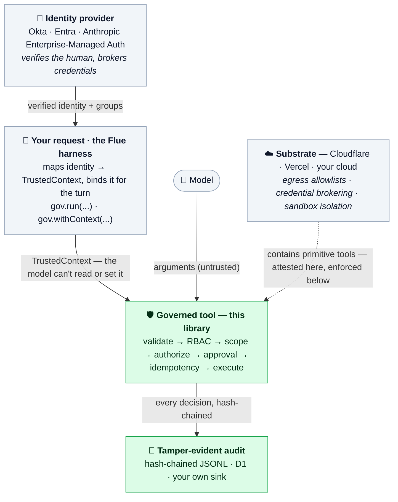

# Architecture

← [Back to the README](../README.md)

## How it fits together

The pieces stack. Identity is established once, up top, by something that already
knows who the human is; it flows down into the trusted context, and every tool
call is decided against it.



The two green boxes are what this library owns: the per-call decision and the
record of it. Everything around them — the identity above, the substrate
below — is the platform's job. Notably, the **substrate** is what actually
*contains* a "primitive" tool (egress allowlists, credential brokering,
isolation); this library attests to that containment and flags it (see
[scoped tools vs primitives](./guide.md#scoped-tools-vs-general-primitives)),
but doesn't enforce it.

## Identity comes from the harness, never the model

The top box is not part of this library, and that's the point. Whatever already
authenticates your users — Okta or Entra groups, or Anthropic's
Enterprise-Managed Auth provisioning the connection through your IdP — is the
source of truth for *who the caller is*. You map its verified claims into the
trusted context once, at the start of the turn, and the model never gets a say
in it:

```ts
// Map your IdP's verified claims into the trusted context. None of this
// comes from the conversation — the model can't read it and can't set it.
await gov.run(
  {
    actor: {
      id: session.user.sub,         // verified subject
      roles: session.user.groups,   // Okta / Entra groups → roles
    },
    tenantId: session.org.id,
    scopes: session.entitlements,    // coarse grants the IdP already knows
  },
  () => harness.prompt(userMessage),
);
```

An IdP gives you coarse identity: *this person is in the `account_admin` group*.
That maps straight onto RBAC — `requireRoles: ["account_admin"]` checks a group
before the tool runs. What an IdP group *can't* express is the per-call question
that bit Meta: "does this admin control *this specific account*?" That's the
authorization and the audit this library adds on top of the identity the harness
already established — the part the IdP can't see and the model shouldn't decide.

---

Next: [Guide](./guide.md) — `authorize` vs `scope`, scoped tools vs primitives,
binding context, and approval.
