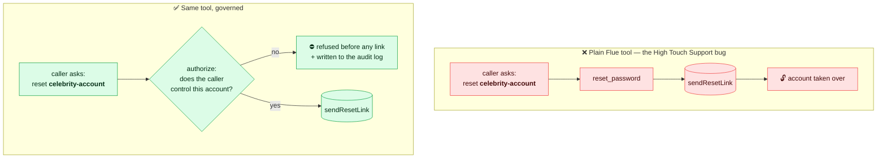

# Guide

← [Back to the README](../README.md)

`govern({ audit })` is the golden-path factory used throughout these examples; it
is exactly `createGovernedToolkit({ audit, defineTool })` with Flue's `defineTool`
wired in. Where an example shows `createGovernedToolkit({ ..., defineTool })`,
that's the explicit, runtime-agnostic core — use it when you want to inject your
own `defineTool` or run outside Flue.

## The fix is a wrapper

The same tool, before and after — the only thing that changes is that the
ownership check now *exists* and runs before the side effect:



Here's a support tool on plain Flue. It resets a password:

```ts
import { createAgent, defineTool } from "@flue/runtime";
import * as v from "valibot";

const resetPassword = defineTool({
  name: "reset_password",
  description: "Send a password reset link for an account.",
  parameters: v.object({ accountId: v.string() }),
  execute: async (a) => {
    await accounts.sendResetLink(a.accountId);
    return `Sent a reset link for ${a.accountId}.`;
  },
});

const agent = createAgent(() => ({ model, tools: [resetPassword] }));
```

This is the High Touch Support bug in miniature. Nothing checks that the caller
is allowed to reset *that* account.

Two things change the moment you wrap it with this library.

First, the tool above won't even define. A `sideEffect: true` tool with no
authorization gate throws a `GovernanceConfigError` at startup and tells you to
add one. The exact HTS failure — a dangerous tool with the check living nowhere
— isn't something you can ship by accident.

Second, here's where the check goes. For account recovery the honest gate is
"does the caller actually control this account," which a static list can't
capture, so it lives in `authorize`:

```ts
import { createAgent } from "@flue/runtime";
import * as v from "valibot";
import { govern, caller } from "flue-guard";

const gov = govern({
  audit: "audit.jsonl", // a path → hash-chained JSONL (or pass your own AuditLog)
});                      // built-in context store + in-memory idempotency by default

const resetPassword = gov.tool({                      // one call → a Flue ToolDefinition
  name: "reset_password",
  description: "Send a password reset link for an account.",
  parameters: v.object({ accountId: v.string() }),
  sideEffect: true,

  // The check HTS never made: does this caller actually control the account?
  // `caller(...)` keys the decision to the authenticated caller (a declared
  // anchor, so it can't be "arg vs nothing"); `a` is inferred from `parameters`.
  // Runs before any link is sent; a false answer logs the refusal.
  authorize: caller((a, ctx) => accounts.isControlledBy(a.accountId, ctx.actor.id)),

  // A retry won't send a second reset link.
  idempotency: { key: (a) => `reset:${a.accountId}` },

  execute: async (a) => {
    await accounts.sendResetLink(a.accountId);
    return `Sent a reset link for ${a.accountId}.`;
  },
});

const agent = createAgent(() => ({ model, tools: [resetPassword] }));
```

The caller's identity comes from your own auth, never the model. You set it once
for the conversation with `gov.run` (reading actor/tenant off `FlueContext`'s
request). No `scopes` here — this tool gates with `authorize`; add them only for
tools that use `scope`.

```ts
await gov.run(
  { actor: { id: "user-7", roles: ["account_holder"] }, tenantId: "app" },
  () => harness.prompt("I'm locked out, can you reset my password?"),
);
```

Now a request to reset someone else's account is refused before `sendResetLink`
runs, and the refusal lands in the audit log. The library doesn't write
`isControlledBy` for you — that ownership check is your business logic, and it's
the part HTS got wrong. What it guarantees is that the check exists, runs every
time before the side effect, and can't be quietly dropped.

## The one idea to take away

The model controls the arguments. You control the context.

The `accountId` in the call comes from the model, which means it can be anything
the conversation talked it into. Treat it as a claim, not a fact. The trusted
context — who the caller is, which accounts they've proven they own — comes from
your authenticated request and travels separately, through `ContextStore`
(`AsyncLocalStorage`). The model can't read it and can't set it.

`scope(args, ctx)` is where those two meet, and it's deliberately the safe
shape: you say what the call *wants to touch*, the library compares it to what
the **caller** is allowed to touch. You never write the comparison, so you can't
forget to involve the caller — the mistake that defeats a check from the inside,
where `accountExists(a.target)` passes the very injection it should stop and the
attack succeeds *through* the check.

When you need a dynamic check `scope` can't express, `authorize` is keyed to a
**declared anchor** so "compare an arg to nothing" has no shape to write:

```ts
// caller identity (the common case) — `a` inferred, no annotation
authorize: caller((a, ctx) => owns(ctx.actor.id, a.target))

// a trusted server-side record — for anonymous recovery, where there's no
// authenticated caller. The named source is resolved before `check` runs; you
// compare the untrusted arg to the trusted value.
authorize: trusted("accountEmail", (a, email) => a.resetEmail === email)
```

Register sources once: `govern({ trustedSources: { accountEmail } })`. The anchor
is also what the governance manifest records, so a reviewer can see *every*
side-effecting tool is keyed to caller or a trusted source — never to an
argument alone.

## Scoped tools vs general primitives

Not every tool can be governed by argument scoping. A `reset_password(accountId)`
has a real *target* you can check against the caller. A `run_sql(query)`, a
shell tool, or a generic `http_request(url, body)` doesn't — the argument *is*
free-form code, and no in-process check can bind what the model writes into it.

So tools are classified by `kind`:

- **`"scoped"`** (default): structured args, a real target → fully governed
  in-process by `scope`/`authorize`.
- **`"primitive"`**: free-form payload. A side-effecting primitive **won't
  define** unless you set `egressControlled: true`, your attestation that its
  blast radius is bounded *out-of-band* (egress allowlist, no in-sandbox
  credential, DB-level controls). Primitives are flagged as **broad** in the
  audit so a reviewer sees them.

```ts
gov.tool({
  name: "run_sql",
  description: "Run a read query.",
  parameters: v.object({ query: v.string() }),
  sideEffect: true,
  kind: "primitive",
  egressControlled: true,   // YOUR attestation: bounded by a read-replica + egress allowlist
  execute: (a, c) => db.run(c.tenantId, a.query),
});
```

Be clear about what this is and isn't. The library **does not verify or enforce**
that containment — `egressControlled` is a developer attestation, not a control
it can check (that containment lives in the substrate: egress, DB, the absent
credential). Its only two jobs for a primitive are honest ones it *can* back:
**refuse to silently certify** a broad, credentialed tool as "governed," and
**flag it broad in the audit**. Enforcing the containment is the substrate's job
(Cloudflare egress, DB row-security); this just stops a primitive from
masquerading as governed and makes its breadth visible.

## Binding context: two patterns

How the trusted context reaches the tool depends on how Flue runs the tool.

**You drive the prompt (workflows, direct calls).** When your code holds the
session and `await`s `session.prompt(...)`, the tool runs inside your async call,
so `ContextStore` (AsyncLocalStorage) carries the context straight through —
that's the Quickstart in the [README](../README.md).

**Flue drives the prompt (dispatched / addressable agents).** With `dispatch()`,
Flue processes the turn on its own, detached from your caller, so an
`AsyncLocalStorage` set around `dispatch()` won't reach the tool. Bind the
context per invocation instead, inside `createAgent`, where you have the
payload:

```ts
const agent = createAgent((ctx) => {
  // ctx.payload / ctx.env came from your authenticated dispatch entrypoint.
  const trusted = deriveTrustedContext(ctx.payload, ctx.env);
  const bound = gov.withContext(trusted); // shares audit/idempotency/etc.

  return {
    model,
    tools: [bound.tool({ name: "reset_password", /* … */ })],
  };
});
```

`withContext` returns a toolkit that resolves the context from that fixed value
(or a resolver you pass), so the bound tool doesn't depend on ambient state.
Same audit log, same idempotency store, per-invocation identity.

## What runs on every call

```
context → validate → RBAC → scope → authorize → approval → idempotency
        → execute → audit
```

Any step can stop the call — allowed or refused, succeeded, replayed, or
errored. A side-effecting call records an `executing` intent before the handler
runs and the outcome after; everything else writes a single record.

- **Scope** keeps a call to one account or one tenant, and keeps callers off
  accounts that aren't theirs.
- **Authorize** is the dynamic check a scope list can't express — "does this
  caller actually own this account?" — the gate Meta's HTS was missing.
- **Idempotency** means a retry replays the first result instead of doing the
  thing twice. The strength of that guarantee is the store's: the in-memory
  default holds within one process; a store with an atomic claim (Redis,
  Postgres) holds across instances. If a write succeeds but recording its
  completion then fails, the key is held — not released — so a retry is *refused*
  rather than silently duplicated. True exactly-once across that window needs a
  transactional store or a downstream idempotency token; this never trades a
  refusal for a duplicate.
- **Audit** is a hash-chained record per call (two for side effects: intent +
  outcome). Edit any past line and `verifyChain()` tells you which one. Add an
  HMAC key and a from-scratch rewrite won't pass either. The file sink
  (`HashChainAuditLog`) is **single-writer** — one process, one instance; for
  multi-instance writers use a store-backed sink (a DB, or the D1 adapter) with
  an atomic append.
- **RBAC**, **approval**, and **PII redaction** are there when you want them, as
  adapters rather than the main story. See
  [Adapters & runtimes](./adapters.md).

## Human-in-the-loop approval

A tool opts into approval with an `approval` policy. `always("side effect")`
requires it on every call and records that reason; a predicate `(a, ctx) => …`
requires it only when it returns a reason string; `never()` is explicit opt-out.

```ts
gov.tool({
  name: "issue_refund",
  // ...
  approval: always("side effect"),
});
```

Per-conversation "approve once" memory belongs in your `ApprovalAdapter` (it
receives `ref` for exactly this), not in the policy — the policy decides
*whether* a call needs approval, the adapter decides *whether it already has it*.

Real approvals take minutes or hours, so blocking the agent while you wait isn't
an option. The approval adapter handles this by *suspending* instead of
blocking: return `{ pending: true }` and the tool call throws an
`ApprovalPendingError` rather than running. Your harness catches it, pauses the
run (Flue can persist and resume a session), and shows the request to a human.
When they decide, you resume — which re-invokes the tool, the adapter is asked
again, and this time it answers for real.

```ts
const approval = {
  async request(req) {
    // Look up (or open) a ticket for this exact call.
    const ticket = await tickets.findOrCreate(req.tool, req.args, req.ctx);

    if (ticket.state === "approved") return { approved: true, approver: ticket.approver };
    if (ticket.state === "rejected") return { approved: false, reason: ticket.reason };
    return { pending: true, ref: ticket.id }; // still waiting → suspend
  },
};

const gov = govern({ audit, approval });
```

```ts
import { isApprovalPending } from "flue-guard";

try {
  await gov.run(trusted, () => harness.prompt(text));
} catch (err) {
  if (isApprovalPending(err)) {
    // Park the run against err.ref (a ticket id) and return to the user.
    // A webhook from your approval system resumes it later.
    await parkRun(err.ref);
  } else throw err;
}
```

Every governance failure is a typed `GovernanceError` with a `code` from a known
union (`scope_violation`, `authorization_denied`, `approval_pending`, …). Branch
without `instanceof` chains using `isGovernanceError`, `isGovernanceDenial` (a
real refusal the model should be told about), and `isApprovalPending` (the
suspend signal).

Two things make this safe. The pending call writes a `defer`/`pending` line to
the audit log, so a request waiting on a human is on the record, not in limbo.
And because the tool re-runs every check on resume, pairing approval with an
`idempotency` key keeps the eventual side effect from running twice even though
the tool was invoked twice — to the strength of your idempotency store (see the
note above).

---

Next: [Adapters & runtimes](./adapters.md) — swapping the defaults and running
on the edge.
